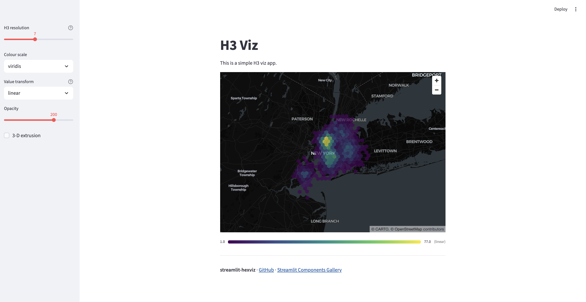
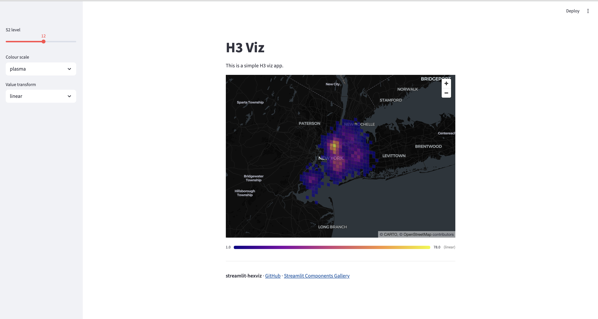

# streamlit-hexviz 🗺️

> Simple H3, S2, and A5 map visualisations for Streamlit.

[](https://app-hexviz-example-app.streamlit.app/)
[](https://pypi.org/project/streamlit-hexviz/)

```python
import streamlit_hexviz as shv

# One line: bin points → hexagons → colour-coded choropleth
shv.h3_map(df, lat="lat", lon="lon", weight="sales")

# Continuous heatmap
shv.h3_heatmap(df, lat="lat", lon="lon")

# Pre-indexed data (from a DB query)
shv.h3_choropleth(df, h3_col="h3_index", value_col="count")

# S2 grid
shv.s2_map(df, lat="lat", lon="lon", level=12)

# A5 grid (pentagonal cells, optional extra)
shv.a5_map(df, lat="lat", lon="lon", weight="sales")
```

Sidebar controls for resolution, colour scale, opacity, and 3-D extrusion are
injected automatically — no boilerplate required.

## Screenshots

### H3 hexagon choropleth (simple app)



### S2 choropleth



---

## Installation

```bash
pip install streamlit-hexviz
# S2 support (optional):
pip install "streamlit-hexviz[s2]"
# A5 support (optinoal):
pip install "streamlit-hexviz[a5]"

# A5 & S2 support (optional):
pip install "streamlit-hexviz[s2,a5]"

```

---

## API reference

### `shv.h3_map(df, ...)` — choropleth from raw points

| Parameter | Type | Default | Description |
|---|---|---|---|
| `df` | DataFrame | required | Input data with coordinate columns |
| `lat`, `lon` | str | `"lat"`, `"lon"` | Coordinate column names |
| `resolution` | int | 7 | H3 resolution (0-15) |
| `weight` | str \| None | None | Column to aggregate; None = count points |
| `agg` | str | `"sum"` | `"sum"`, `"mean"`, `"count"`, `"max"`, `"min"` |
| `transform` | str | `"linear"` | `"linear"`, `"log"`, `"quantile"` |
| `colour_scale` | str | `"viridis"` | `viridis`, `plasma`, `heat`, `blues`, `reds`, `greens` |
| `alpha` | int | 200 | Fill opacity 0-255 |
| `extruded` | bool | False | 3-D bar chart mode |
| `elevation_scale` | float | 100 | Vertical exaggeration (extruded only) |
| `map_style` | str | `"dark"` | `"dark"`, `"light"`, `"road"`, `"satellite"` |
| `tooltip` | str \| None | None | HTML tooltip; use `{value}`, `{h3_index}` |
| `use_sidebar_controls` | bool | True | Inject resolution/colour controls into sidebar |
| `key` | str \| None | None | Streamlit widget key prefix |

**Returns:** aggregated DataFrame with columns `h3_index`, `value`, `lat`, `lon`, `fill_color`, `geometry`.

---

### `shv.h3_heatmap(df, ...)` — continuous density heatmap

Same coordinate params. Extra params: `radius_pixels` (default 40).

---

### `shv.h3_choropleth(df, ...)` — pre-indexed data

| Parameter | Default | Description |
|---|---|---|
| `h3_col` | `"h3_index"` | Column containing H3 cell tokens |
| `value_col` | `"value"` | Column to visualise |

---

### `shv.s2_map(df, ...)` — S2 grid (optional extra: `pip install "streamlit-hexviz[s2]"`)

Same as `h3_map` but uses `level` (0-30) instead of `resolution`.

---

### `shv.a5_map(df, ...)` — A5 grid (optional extra: `pip install "streamlit-hexviz[a5]"`)

Bins points into pentagonal [A5](https://a5geo.org) cells. Same shape as
`h3_map`, with an `a5_index` column and its own resolution range.

| Parameter | Type | Default | Description |
|---|---|---|---|
| `df` | DataFrame | required | Input data with coordinate columns |
| `lat`, `lon` | str | `"lat"`, `"lon"` | Coordinate column names |
| `resolution` | int | 11 | A5 resolution (0-30) |
| `weight` | str \| None | None | Column to aggregate; None = count points |
| `agg` | str | `"sum"` | `"sum"`, `"mean"`, `"count"`, `"max"`, `"min"` |
| `transform` | str | `"linear"` | `"linear"`, `"log"`, `"quantile"` |
| `colour_scale` | str | `"viridis"` | `viridis`, `plasma`, `heat`, `blues`, `reds`, `greens` |
| `alpha` | int | 200 | Fill opacity 0-255 |
| `extruded` | bool | False | 3-D bar chart mode |
| `elevation_scale` | float | 100 | Vertical exaggeration (extruded only) |
| `map_style` | str | `"dark"` | `"dark"`, `"light"`, `"road"`, `"satellite"` |
| `tooltip` | str \| None | None | HTML tooltip; use `{value}`, `{a5_index}` |
| `use_sidebar_controls` | bool | True | Inject resolution/colour controls into sidebar |
| `key` | str \| None | None | Streamlit widget key prefix |

**Returns:** aggregated DataFrame with columns `a5_index`, `value`, `lat`, `lon`, `fill_color`.

---

### `shv.a5_choropleth(df, ...)` — pre-indexed A5 data

| Parameter | Default | Description |
|---|---|---|
| `a5_col` | `"a5_index"` | Column containing A5 cell IDs |
| `a5_index_type` | `"hex"` | `"hex"` (hex string tokens) or `"int"` (raw 64-bit ints) |
| `value_col` | `"value"` | Column to visualise |

A5 cell IDs are 64-bit integers, which exceed JavaScript's safe integer
range — `a5_map`/`a5_choropleth` always store and pass `a5_index` as a hex
string internally (via `a5.u64_to_hex`) to avoid precision loss when
pydeck serialises the DataFrame to JSON for the browser. Pass
`a5_index_type="int"` to `a5_choropleth` if your source column has raw ints;
they'll be converted automatically.

---

## Transforms

| Name | Best for |
|---|---|
| `linear` | Uniformly distributed values |
| `log` | Heavy-tailed count distributions |
| `quantile` | Any distribution; highlights relative rank |

---

## H3 resolution guide

| Resolution | Avg area | Typical use |
|---|---|---|
| 5 | ~252 km² | Country-level |
| 7 | ~5.2 km² | City-level |
| 9 | ~0.1 km² | Neighbourhood |
| 11 | ~0.001 km² | Block-level |

---

## A5 resolution guide

A5 pentagons roughly quarter in area per resolution step (vs. H3's ~7x
factor), so equivalent detail sits at a higher resolution number. Figures
below are computed directly via `a5.cell_area(resolution)`.

| Resolution | Avg area | Typical use |
|---|---|---|
| 3 | ~531,000 km² | Subcontinent-level |
| 8 | ~519 km² | Country/region-level |
| 11 | ~8 km² | City-level (a5_map default) |
| 15 | ~0.03 km² | Neighbourhood |
| 20 | ~31 m² | Parcel/building-level |

---

## Running the demo

### Visualization the basic maps
```bash
pip install streamlit h3 pydeck numpy pandas
streamlit run examples/app_simple.py
```

### More interactive app demo

```bash
pip install streamlit[s2,a5] h3 pydeck numpy pandas
streamlit run examples/demo_app.py
```


---


## Contributing

PRs welcome! See [CONTRIBUTING.md](CONTRIBUTING.md).

---

## License

MIT
